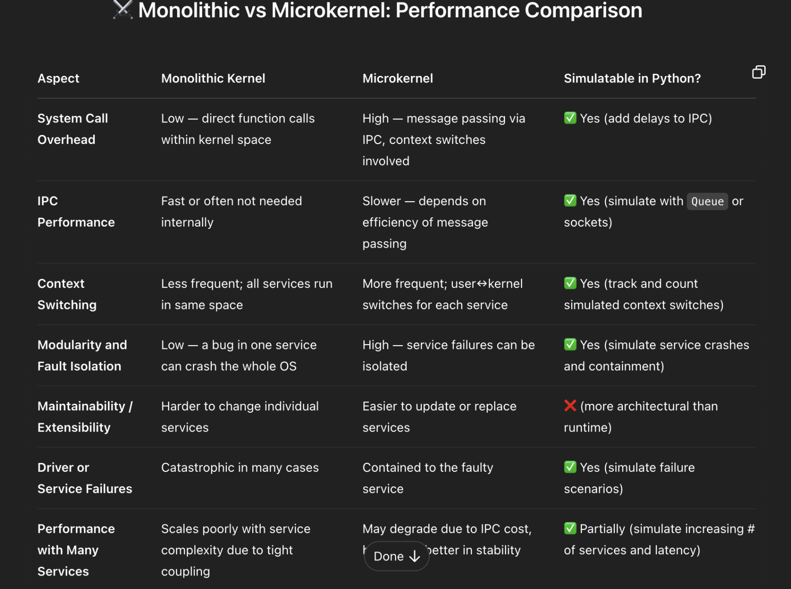

# OS_Comparison

Comparison of Monolithic and Microkernel Operating Systems

## File Structure

- **main.py** contains the implementation of our OSes and comparisons.
- **comparisons.py** contains the comparison functions that will be used in the main.
- **MicroKernel_Implementation.py** contains the implementation of the MicroKernel class and its functions.
- **Monolithic_Implementation.py** contains the implementation of the Monolithic class and its functions.

## Comparisons Impementations

### Context Switching Overhead

### IPC Performance

#### What to measure

- The time it takes for both OSes to pass a message between modules.
- 

#### Takeaway

